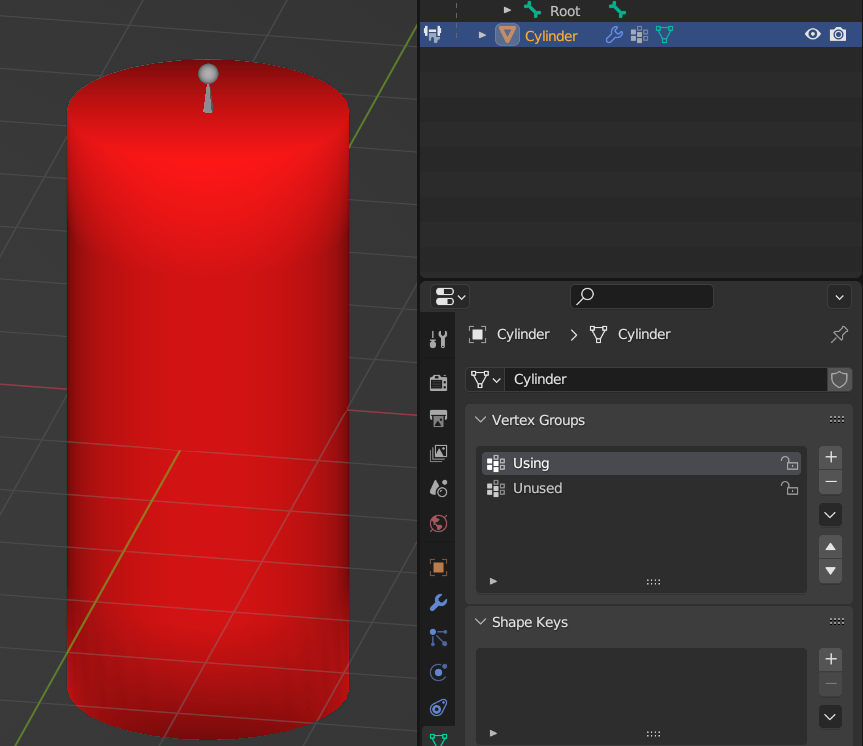
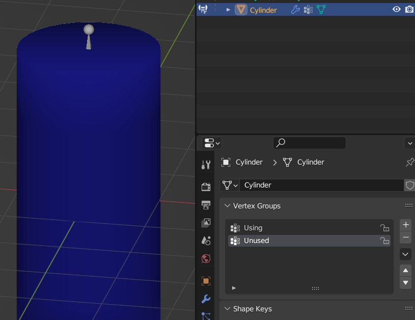
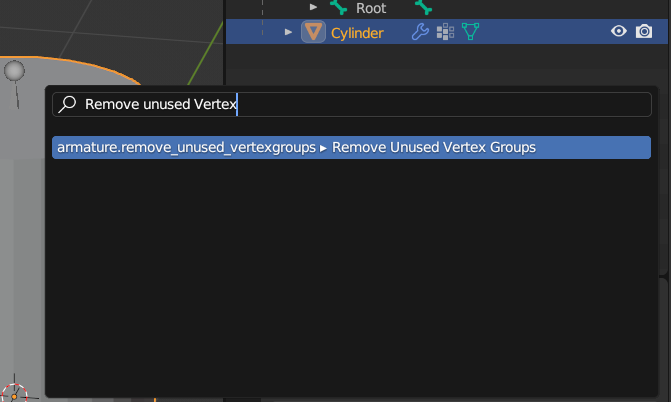
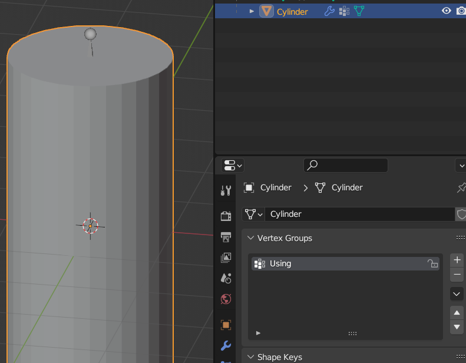
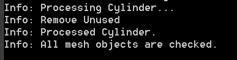
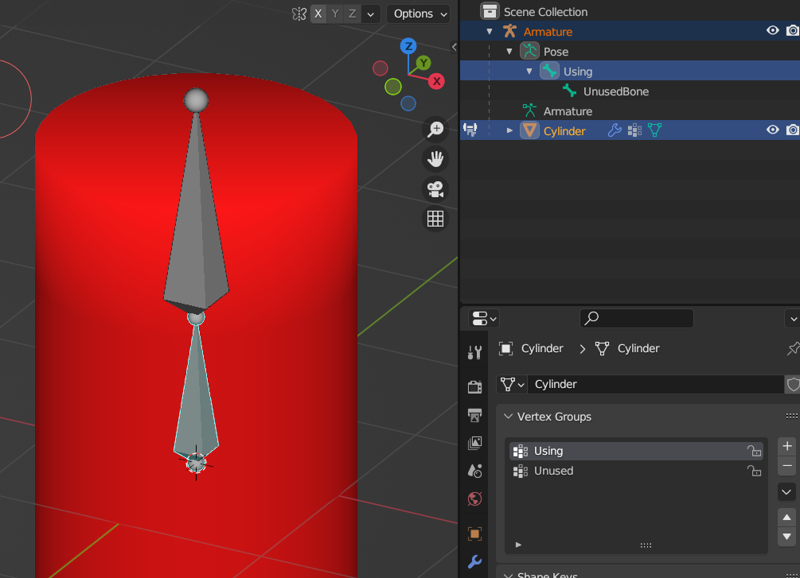
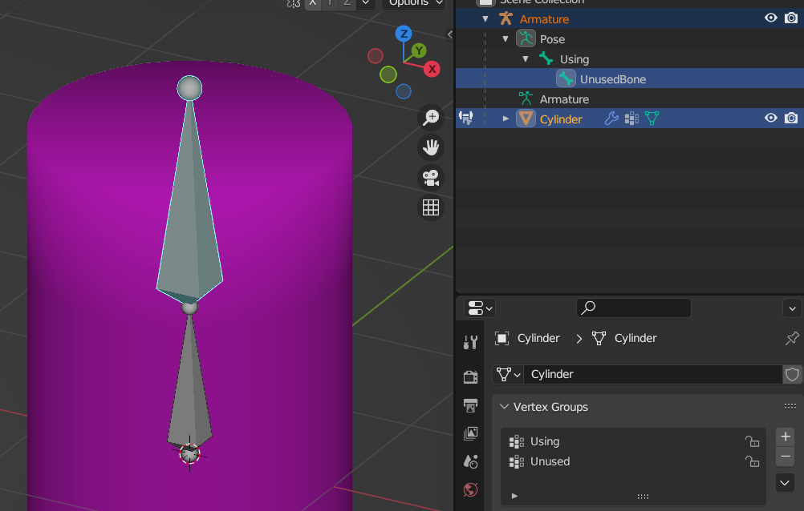
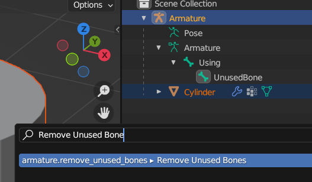
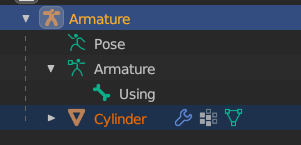
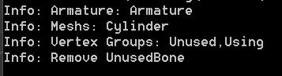

# What's this?
A blender addon used for removing empty vertex groups and bones with no corresponding vertex groups.

# Install
* Download from [github release](https://github.com/aoirusann/BlenderAddon_RemoveUnuseVertexGroupsAndBones/tags)
* Then just install the `.zip` file in the same way as other blender addons
* NOTE: You need to enable `Setting - Interface - Display - Develop Extras` to use this plugin. (thanks for @minitiv)

# Usage

## Remove unused vertex groups
1. Select some mesh objects whose vertex groups will be checked.
2. F3 - Remove Unused VeretxGroups
3. The empty vertex groups on the mesh objects should have been removed.

For example (in `demo.blend`):

* Vertex Group `Using` is being used
	* 
* Vertex Group `Unused` is empty
	* 
* Select `Cylinder`
* Press `F3`
* Type `Remove Unused VeretxGroups`
	* 
* Vertex Group `Unused` was removed
	* 
* Log can be found in `Window - Toggle System Console`
	* 

## Remove unused bones
1. Select some mesh objects whose vertex groups will be checked.
2. Ctrl+Click select an armature object whose bone will be removed. (Make sure the armature is the active object)
3. F3 - Remove Unused Bones
4. The bones on the armature object which are not referred by the vertex groups of mesh objects should have been removed.

For example (in `demo.blend`):

* Bone `Using` has the corresponding vertex group `Using` in the `Cylinder`
	* 
* Bone `UnusedBone` has no corresponding vertex group in the `Cylinder`
	* 
* Select `Cylinder`
* CTRL+Click Select `Armature`
* Press `F3`
* Type `Remove Unused Bone`
	* 
* Bone `UnusedBone` was removed
	* 
* Log can be found in `Window - Toggle System Console`
	* 
