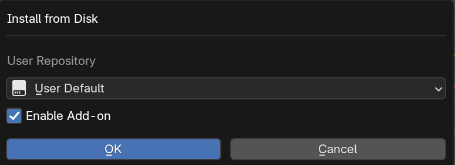
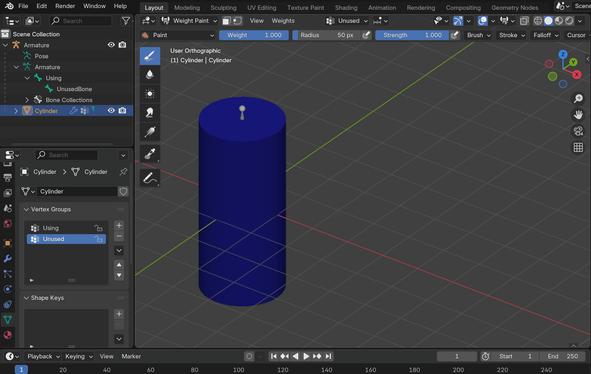
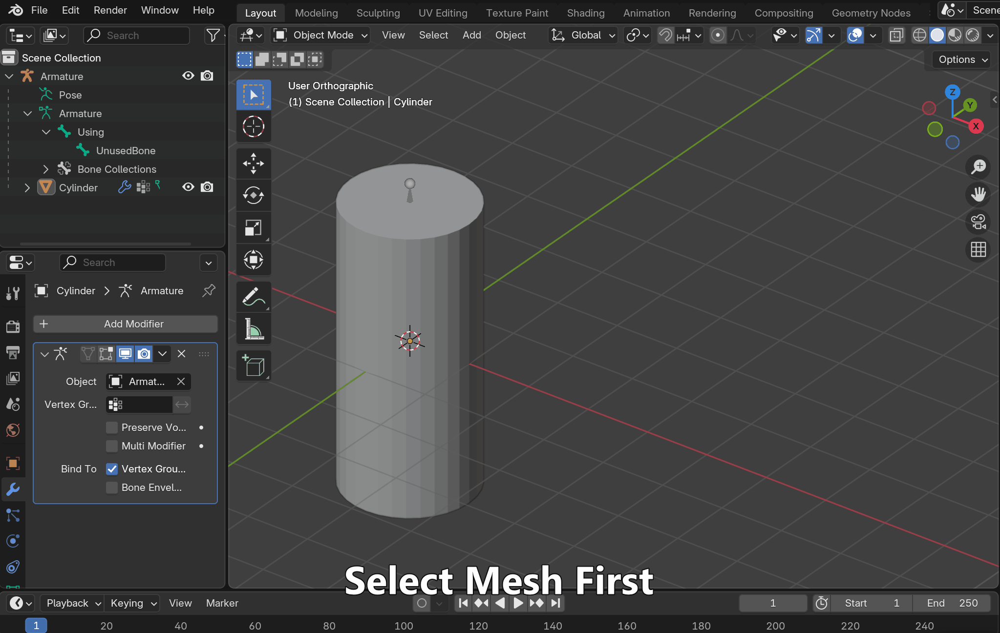

# What's this?
A blender extension used for removing empty vertex groups and bones with no corresponding vertex groups.

# Install(Blender 4.2+)
1. Download zip file from [github release](https://github.com/aoirusann/BlenderAddon_RemoveUnuseVertexGroupsAndBones/tags)
2. Open Blender and drag zip file into it
3. Select a repository (e.g. User Default)
4. Toggle on `Enable Add-on` and click `OK`

# Usage

## Remove unused vertex groups
1. Select some mesh objects whose vertex groups will be checked.
2. Click `Object - Clean Up - Remove Unused Vertex Groups`
3. The empty vertex groups on the mesh objects should have been removed.

## Remove unused bones
1. Select some mesh objects whose vertex groups will be checked.
2. Ctrl+Click select an armature object whose bone will be removed. (Make sure the armature is the active object)
3. Click `Object - Clean Up - Remove Unused Bones`
4. The bones on the armature object which are not referred by any vertex group in mesh objects should have been removed.

